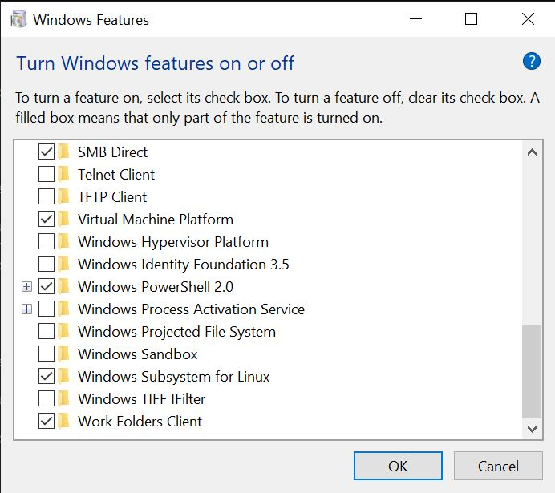
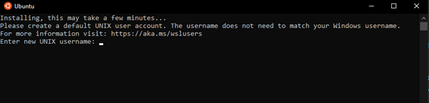
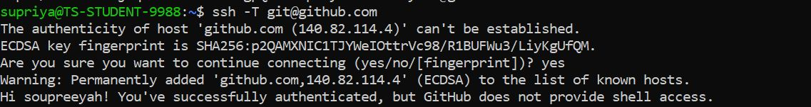
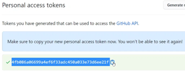

## **Setting up Ruby on Rails in Windows (WSL-Ubuntu)**

1.	Make sure the ‘Windows Subsystem for Linux’ is checked.




2.	Download and Install Ubuntu from the Microsoft App Store.
3.	Run 
```
Enable-WindowsOptionalFeature -Online -FeatureName Microsoft-Windows-Subsystem-Linux
```
   Restart computer when prompted.

4.	Open Ubuntu and set up your Unix username:


    Remember your password, you will need it every time you run a ‘sudo’ command.
    
5.	Install all the latest updates. Enter password when prompted.

```
sudo apt update
```

## **Installing rbenv:**

### Refer: https://gorails.com/setup/windows/10 

1.	Install the following dependencies for Ruby: 

```
sudo apt-get install git-core curl zlib1g-dev build-essential libssl-dev libreadline-dev libyaml-dev libsqlite3-dev sqlite3 libxml2-dev libxslt1-dev libcurl4-openssl-dev software-properties-common libffi-dev
```
2.	Installing with rbenv is a simple two step process. First you install rbenv, and then ruby-build: 
```
cd 
git clone https://github.com/rbenv/rbenv.git ~/.rbenv 
echo 'export PATH="$HOME/.rbenv/bin:$PATH"' >> ~/.bashrc 
echo 'eval "$(rbenv init -)"' >> ~/.bashrc 
exec $SHELL 
```
```
git clone https://github.com/rbenv/ruby-build.git ~/.rbenv/plugins/ruby-build 
echo 'export PATH="$HOME/.rbenv/plugins/ruby-build/bin:$PATH"' >> ~/.bashrc 
exec $SHELL
```
3.	Install the version of rbenv you want. Replace <version> with the version you want. Eg. 3.2.1
```
rbenv install <version>
```
4.	Set the default version.
```
rbenv global <version>
```
5.	Check the ruby version by:
```
ruby -v  
```
6.	To turn off local documentation for each gem we install
```
echo “gem: –no-document” > ~/.gemrc
```  
7.	Install the gem bundler for application dependencies
```
gem install bundler
```
8.	Now install the latest version of rails eg. 7.0.4.2
```
gem install rails -v <version>
```
9.	Run the following command to make the rails executable available:
```
rbenv rehash
```
10.	Check the rails version by:
```
rails -v
```

## **Configuring Git in Ubuntu:**

### Refer: https://gorails.com/setup/windows/10#git
  
1.	Replace my name and email address in the following steps with the ones you used for your Github account.
```
git config --global color.ui true 
git config --global user.name "YOUR NAME" 
git config --global user.email "YOUR@EMAIL.com" 
ssh-keygen -t rsa -b 4096 -C "YOUR@EMAIL.com"
```
2.	Take the newly generated SSH key (begins with ssh-rsa)and add it to your Github account
```
cat ~/.ssh/id_rsa.pub
```
3.	Go to your github account->go to Settings-> Go to SSH and GPG keys
Click on “New SSH Key”  
Add new title and key.
4.	You can check to see if this worked.
```
ssh -T git@github.com
```
5.	You should see a message like this:


## **Generating a token for Git:**
  
1.	Under your GitHub user profile (not the repository profile), click the “Settings” link.
2.	Scroll down and click the “Developer Settings” link.
3.	Click the GitHub “Personal access tokens” link and click the “Generate new token” link and provide your password again if required
4.	Copy and keep this token on you – this will be your new password when clone next!


  
## **Installing PostgreSQL on Windows (WSL-Ubuntu)**
  
1.	The libpq-dev package contains the header files and libraries needed to compile and build applications that use the PostgreSQL database. These files are required if you want to build and install third-party PostgreSQL extensions or applications that interact with a PostgreSQL database.
```
sudo apt install libpq-dev
```
2.	Change directory to mnt, which provides access to the C: drive in Windows.
```
cd mnt/c
```
3. Make a new directory for your code in the C: drive (optional but good to have, so all your code is in one place) and change directory to that folder
```
mkdir -p code
cd code
```
4.	Install the latest PostgreSQL version along with the newest extensions and additions.
```
sudo apt-get install postgresql postgresql-contrib
```
5.	Check the status of PostgreSQL by:
```
sudo systemctl status postgresql
```
6.	If the service keeps exiting try : sudo pg_ctlcluster <postgres version> main start
For example: **sudo pg_ctlcluster 12 main start**
7.	By default, you are user ‘postgres’ connected to database ‘postgres’ at port 5432. If you want to make password changes you can do that by 
8.	By default, you are user ‘postgres’ connected to database ‘postgres’ at port 5432. If you want to make password changes you can do that by 
9.	A “psql” command-line client tool is used to interact with the database engine. You should invoke it as a “postgres” user to start an interactive session with your local database.
```
sudo -u postgres psql
```
10.	Then you can proceed with creating a new ruby on rails application.
